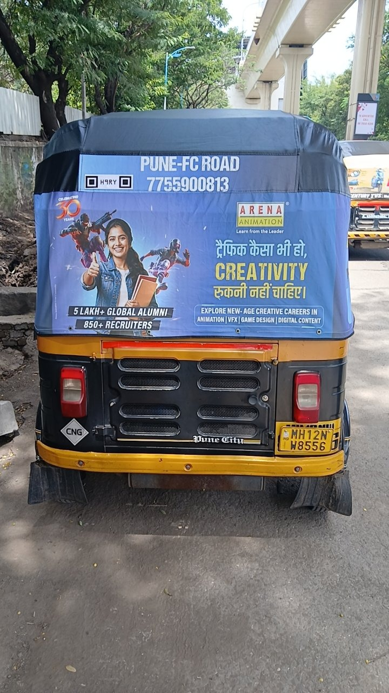
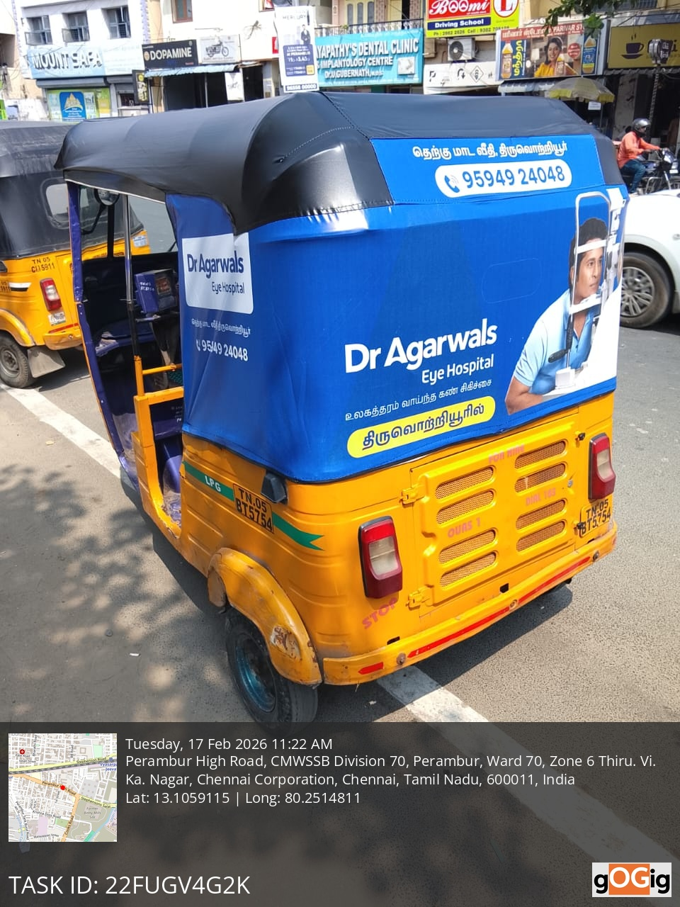
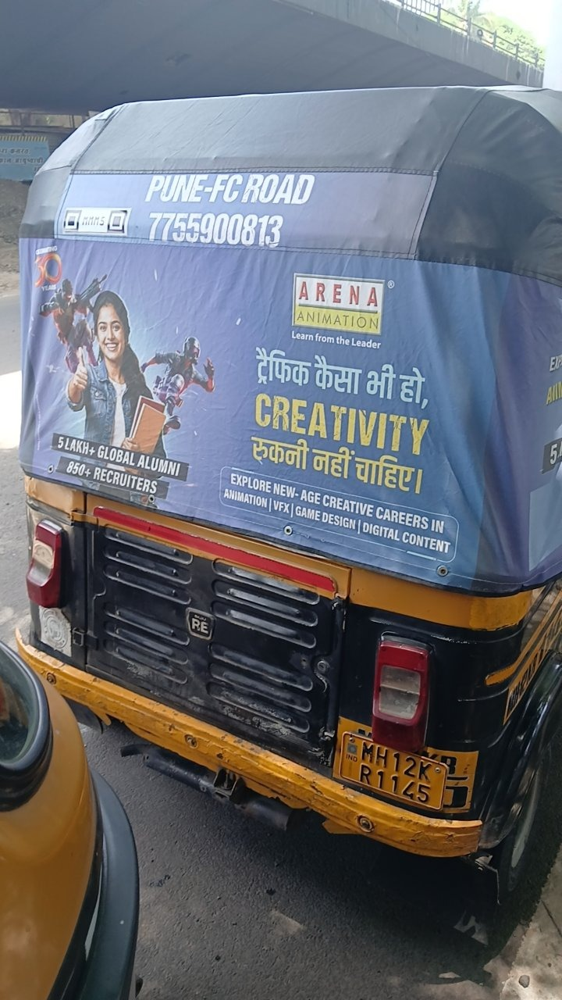

# Intelligent Media Processing Pipeline

Async backend for uploading vehicle images, running quality and validity
checks in the background, and exposing status plus structured results via an
API and a simple web dashboard.

## Features

- Upload vehicle images through the REST API or the built-in web UI
- Process images asynchronously using Redis/RQ or an inline fallback queue
- Run multiple validation checks such as blur, brightness, screenshot,
  tamper, OCR plate format, and duplicate detection
- Return per-check results with confidence scores and human-readable details

## Screenshots

The output images are stored in the images folder and can be displayed here:

```md



```

## Architecture

### Service flow

1. `POST /images` accepts a multipart file upload.
2. The file is validated (extension) and saved to disk under a random UUID
   name (`app/storage.py`). Storage is abstracted behind `save_upload()` so
   swapping local disk for S3 later only requires changing that one file.
3. A row is inserted into the `images` table with `status=pending`, and a
   job is enqueued onto Redis via RQ, keyed by the image's UUID.
4. The API returns `202 Accepted` with the image ID immediately -- the
   caller never waits on processing.
5. A separate **worker** process (`app/worker.py`) picks the job off the
   queue, runs `process_image()` (`app/tasks.py`):
   - sets status to `processing`
   - runs each check function (`app/checks/*.py`)
   - writes one `analysis_results` row per check
   - sets status to `completed`, or `failed` with a `failure_reason` if
     something throws
6. `GET /images/{id}/status` and `GET /images/{id}/results` let the client
   poll for progress and then fetch the structured findings.

### Queue strategy

Chose **RQ (Redis Queue)** over Celery/SQS/RabbitMQ for this assignment:
- Minimal setup (just Redis) -- fast to run locally and in Docker Compose.
- Simple mental model: `queue.enqueue(fn, args)` in the API,
  `Worker(...).work()` in a separate process. Easy to explain in a review.
- Built-in job-level retries (`rq.retry.Retry`) cover the "transient
  failure" case (e.g. DB momentarily unreachable) without extra code.

Celery would be the natural upgrade for production (better observability,
native rate limiting, scheduled tasks, multiple broker backends). SQS would
make sense if this were deployed on AWS and needed managed durability/DLQs
without running Redis at all. The processing logic in `tasks.py` doesn't
depend on RQ specifics beyond the function signature, so swapping the queue
backend later is mostly a matter of changing `main.py`/`worker.py`.

### Two queue backends (`QUEUE_BACKEND` env var)

The app supports two interchangeable modes, controlled by one environment
variable, without touching the check/processing logic at all:

- **`QUEUE_BACKEND=rq`** (default) — the "real" architecture described
  above: Redis + RQ + a separate worker process. This is what
  `docker-compose.yml` runs, and what the main `render.yaml` deploys.
- **`QUEUE_BACKEND=inline`** — no Redis, no separate worker. The API
  process itself runs each job in a background thread via FastAPI's
  `BackgroundTasks`, right after returning the `202` response. This is
  what `render.free.yaml` deploys, since it lets the whole app run as a
  single free-tier web service (no paid Background Worker, no Redis
  add-on required).

Both paths call the exact same `process_image()` function, so the checks,
DB writes, and status transitions are identical either way — only how the
job gets scheduled differs. The trade-off with `inline` is real, though:
a job is only in memory once accepted, so if the process restarts or
redeploys mid-job, that job is silently lost (no dead-letter queue, no
automatic retry across a crash) and the image stays stuck in `processing`
forever. `rq` mode survives worker restarts because the job lives in
Redis until acknowledged. `inline` is a legitimate, explicitly-allowed
choice per the assignment ("in-memory queue" is listed as valid) — it's
just a different point on the durability-vs-infrastructure-cost line, and
appropriate for a demo deployment rather than production.

### Processing/analysis strategy

Five checks run per image, each returning `{passed, confidence, detail}`
instead of a bare boolean -- the assignment explicitly asks for "structuring
uncertainty," so every check reports how confident it is and why, not just
pass/fail:

| Check | Approach |
|---|---|
| `blur_detection` | OpenCV Laplacian variance; low variance = blurry |
| `brightness_analysis` | Mean grayscale pixel value; flags too-dark or overexposed |
| `screenshot_detection` | Heuristic: missing camera EXIF **and** exact match to a known screen resolution |
| `tamper_heuristic` | Error Level Analysis (recompress at fixed JPEG quality, diff against original) |
| `plate_format_validation` | Tesseract OCR, then regex match against the Indian plate format `[A-Z]{2}[0-9]{1,2}[A-Z]{1,3}[0-9]{4}` |
| `duplicate_detection` | Perceptual hash (`imagehash.phash`) compared via Hamming distance against every previously stored hash |

Each check is isolated with its own try/except in `tasks.py` -- one broken
check (e.g. OpenCV choking on a corrupt file) is recorded as a failed check
result, not a failed job. The whole job is only marked `failed` if something
outside the checks themselves breaks (DB connection lost, disk full, etc.).

### Data model

- **images**: id (UUID), original_filename, storage_path, content_type,
  size_bytes, status (enum: pending/processing/completed/failed),
  failure_reason, uploaded_at, updated_at
- **analysis_results**: id, image_id (FK), check_name, passed, confidence,
  detail, created_at -- one row per check per image, so results are
  queryable/filterable independently and the schema doesn't need to change
  every time a new check is added
- **image_hashes**: image_id (FK, PK), phash -- kept in its own table so
  duplicate lookups don't have to scan the (potentially much wider) images
  table

## AI Usage Disclosure

**[Fill this in honestly based on your actual process -- template below]**

- **Where I used AI**: e.g. scaffolding the FastAPI/RQ/SQLAlchemy boilerplate,
  drafting the Docker Compose file, generating the ELA/perceptual-hash
  check implementations as a starting point.
- **What AI helped with**: getting a working skeleton fast so I could spend
  my time on the harder judgment calls (schema design, retry strategy,
  which heuristics to trust).
- **Where AI output was wrong or needed correction**: be specific here --
  e.g. "the generated retry config didn't set a job timeout, so a hung
  check would have blocked the worker indefinitely," or "the first OCR
  regex didn't account for lowercase/spaced plate text."
- **How I validated it**: ran the test suite, manually uploaded a few real
  and synthetic (blurry/dark/duplicate) images and inspected the results,
  read through generated code line-by-line before committing rather than
  pasting it in wholesale.

## Trade-offs

**Intentionally simplified:**
- Local disk storage instead of S3 (storage is abstracted so this is a
  one-file change later).
- Thresholds for blur/brightness/duplicate/ELA are reasonable starting
  points, not calibrated against a labeled dataset.
- No authentication/authorization on the API.
- `Base.metadata.create_all()` on startup instead of Alembic migrations.
- Duplicate detection does an O(n) hash comparison against every stored
  image -- fine at small scale, would need an indexed nearest-neighbor
  structure at real scale.
- Screenshot/tampering heuristics are intentionally conservative (they
  under-flag rather than over-flag) since both are inherently noisy
  signals without a labeled training set.

**What I'd improve with more time:**
- A confidence-weighted overall verdict per image, not just per-check results.
- Alembic migrations, structured JSON logging, request tracing.
- A small dashboard/UI for browsing results (bonus item).
- Calibrate thresholds against a real sample of field-uploaded vehicle photos.
- Rate limiting on the upload endpoint.

**Scalability concerns:**
- Single worker process as configured; RQ supports running many worker
  processes/containers against the same queue for horizontal scaling with
  no code changes.
- Large uploads / high throughput would want direct-to-S3 presigned uploads
  instead of proxying the file through the API process.

**Failure handling concerns:**
- Worker crashes mid-job: RQ's `Retry` re-enqueues transient failures; a
  crash that corrupts the DB session is caught by the outer try/except in
  `process_image` and marks the image `failed` with a reason rather than
  leaving it stuck in `processing`.
- No dead-letter queue visibility beyond RQ's own failed-job registry --
  worth wiring up `rq-dashboard` for real observability.

## Running instructions

Requires Docker and Docker Compose.

```bash
cp .env.example .env   # optional, only needed for running outside Docker
docker compose up --build
```

This starts Postgres, Redis, the API (port 8000), and a worker. Tables are
created automatically on API startup.

API docs (Swagger UI): http://localhost:8000/docs

### Dashboard

A minimal upload/status dashboard is served at http://localhost:8000/ — drag
or click to upload an image, watch its status update live, and expand it to
see the per-check results without needing curl or Swagger. This is a bonus
convenience layer on top of the API; the API itself is the graded surface.

### Deploying for free (Render)

Deployment isn't required by the assignment, but two Render blueprints are
included if you want it live:

- `render.yaml` — the full architecture (API + worker + Postgres + Redis).
  Render has no free Background Worker tier, so this requires a paid
  ($7/mo) plan for the worker service specifically.
- `render.free.yaml` — single web service running with
  `QUEUE_BACKEND=inline` (see architecture section above) + free Postgres.
  No worker, no Redis, nothing paid. In the Render dashboard: **New →
  Blueprint**, point it at this repo, and select `render.free.yaml` as the
  blueprint file. Note Render's free web service has no persistent disk,
  so uploaded files won't survive a restart/redeploy -- fine for a demo
  click-through, not for real persistence (swap `storage.py` for S3 to fix
  that properly).

### Running tests

```bash
pip install -r requirements.txt
pytest tests/
```

## Sample API requests

**Upload an image**
```bash
curl -X POST http://localhost:8000/images \
  -F "file=@/path/to/vehicle.jpg"
```
```json
{
  "id": "3fa85f64-5717-4562-b3fc-2c963f66afa6",
  "status": "pending",
  "uploaded_at": "2026-07-21T10:00:00Z"
}
```

**Check status**
```bash
curl http://localhost:8000/images/3fa85f64-5717-4562-b3fc-2c963f66afa6/status
```
```json
{
  "id": "3fa85f64-5717-4562-b3fc-2c963f66afa6",
  "status": "completed",
  "failure_reason": null,
  "uploaded_at": "2026-07-21T10:00:00Z",
  "updated_at": "2026-07-21T10:00:04Z"
}
```

**Fetch results**
```bash
curl http://localhost:8000/images/3fa85f64-5717-4562-b3fc-2c963f66afa6/results
```
```json
{
  "id": "3fa85f64-5717-4562-b3fc-2c963f66afa6",
  "status": "completed",
  "failure_reason": null,
  "results": [
    {"check_name": "blur_detection", "passed": true, "confidence": 0.87, "detail": "Laplacian variance=342.1 (threshold=100.0). Image appears sharp."},
    {"check_name": "brightness_analysis", "passed": true, "confidence": 0.91, "detail": "Mean pixel value=128.4 ..."},
    {"check_name": "screenshot_detection", "passed": true, "confidence": 0.55, "detail": "Dimensions (4032, 3024) don't match common screen resolutions."},
    {"check_name": "tamper_heuristic", "passed": true, "confidence": 0.72, "detail": "ELA mean error=3.2, max=41 (threshold=8.0). No strong tampering signal."},
    {"check_name": "plate_format_validation", "passed": true, "confidence": 0.8, "detail": "Extracted plate 'KA05MH1234' matches expected Indian format."},
    {"check_name": "duplicate_detection", "passed": true, "confidence": 0.7, "detail": "No matching image found within hash distance threshold."}
  ]
}
```

## Assumptions

- Input images are standard vehicle photos in JPEG/PNG/WebP format.
- "Indian vehicle number format" refers to the standard state-code +
  RTO-code + series + number scheme; state-specific edge cases (e.g. BH
  series, older formats) are not special-cased.
- A single image belongs to a single processing job; batch upload isn't
  in scope.
- Confidence scores are heuristic self-reported estimates from each check,
  not calibrated probabilities.
